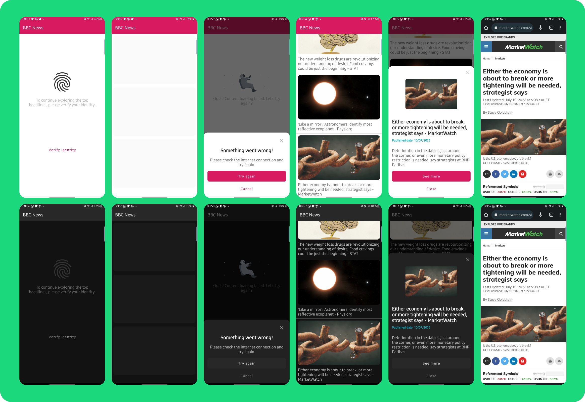
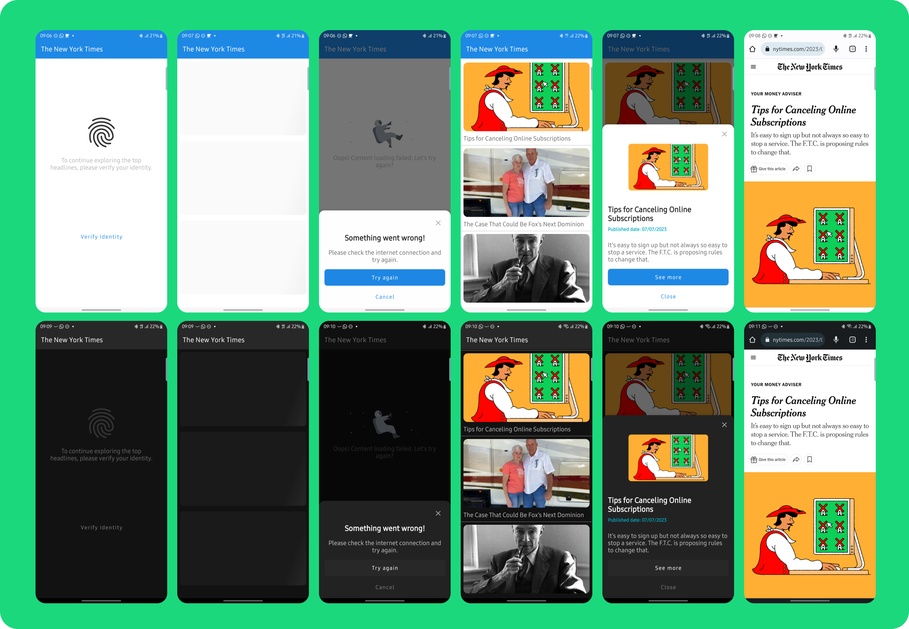

# BuildNews
A white label challenge, empowering you to create custom news apps effortlessly.

# Android News App Challenge

This repository contains the code for an Android application that displays top news headlines for a specific source. This project was undertaken as part of the Android Developer position challenge for Critical TechWorks.

## Data Sources

The application leverages two prominent news APIs to fetch the top headlines:

- **[NewsAPI](https://newsapi.org/docs/endpoints/top-headlines):** The primary data source for fetching top headlines from BBC News.

- **[NYTimesAPI](https://developer.nytimes.com/get-started):** An additional data source used for another flavor of the application that presents news from The New York Times.

## Features

- **Top Headlines:** The app fetches and displays the top headlines from the specific news source using the NewsAPI `newsapi flavor` and NYTimesAPI `nytimesapi flavor`.

- **Article Details:** Tapping on a headline presents a detailed view of the article, displaying the image, title, description, and content (when available). Additionally, users have the option to read the article in more detail by following a provided link to the source of the news.

- **Fingerprint Authentication:** The app prompts the user for fingerprint authentication upon opening, if the feature is available and configured on the device.

- **Support for Multiple News Sources:** New flavors are created to present news from different sources. These flavors are implemented as modules outside of the app module, which provides better organization and maintainability. In the event a new flavor with a new data source is created, it can be easily added to the centralizing module for flavors. This design allows for the easy extension and management of multiple news sources within the application.

## Additional Modules

- **Arch Module:** Contains utility classes such as extensions, testing rules, and other helpers for improving the development experience.

- **Design Module:** Includes a design system encapsulating colors, dimensions (dp, sp), drawables, etc., ensuring a consistent visual design across the application.

## Architecture and Libraries

The application is built using the following technologies:

- **Architecture:** MVVM/MVI with Clean Architecture principles
- **Asynchronous programming:** Flow, StateFlow for screen state management, and SharedFlow for single-shot events
- **Networking:** Retrofit for network calls.
- **Parsing:** Gson for parsing JSON data.
- **Image Loading:** Coil for loading and caching images.
- **Dependency Injection:** Koin.
- **Unit Testing:** JUnit, Mockk.
- **Quality control:** Jacoco for code coverage, Detekt for static code analysis
- **UI Testing:** Espresso <del>(Not Yet Implemented)</del>
- **Local Database:** Room <del>(Not Yet Implemented)</del>
- **Paging:** Paging 3 <del>(Not Yet Implemented)</del>

Here is the updated step-by-step guide to include new flavor addition:

# How to Build

To build this project, you will need to generate your API key from NewsAPI, NYTimesAPI and for any other flavors you plan to add, and include them in your project:

1. Generate your API keys from NewsAPI, NYTimesAPI and other APIs you intend to use.
2. Create a file named `api_keys.properties` in the project root directory.
3. Add the following lines to the file:
   ```
   NEWS_API_KEY="Your-NewsAPI-Key-Here"
   NY_TIMES_API_KEY="Your-NYTimesAPI-Key-Here"
   YOUR_FLAVOR_API_KEY="Your-FlavorAPI-Key-Here"
   ```
   Replace `Your-NewsAPI-Key-Here`, `Your-NYTimesAPI-Key-Here` and `Your-FlavorAPI-Key-Here` with your actual API keys.

Then you can clone this repository and import into Android Studio to build the application.

# How to add a new Flavor

To add a new flavor to this project, follow these steps:

1. Open the `flavor-build.gradle` file and add your flavor details inside the `productFlavors` block. Here's an example of what you should add:

   ```
   yourflavor {
       dimension "app"
       ext.appIdSuffix = '.yourflavorapi'
       manifestPlaceholders = [appName: "Your Flavor"]
       buildConfigField 'String', 'QUERY_PARAM', '"apiKey"'
       buildConfigField 'String', 'BASE_URL', '"https://yourflavorapi.com/"'
       buildConfigField "String", "API_KEY", keyApiProperties['YOUR_FLAVOR_API_KEY']
   }
   ```

2. Add a `sourceSet` for your flavor:

   ```
   sourceSets {
       yourflavor {
           res.srcDirs file("$rootDir/flavors/yourflavor/src/main/res")
       }
   }
   ```

3. Create a new module for your flavor with the name `yourflavorapi`. In the `build.gradle` of the new module, add the following:

   ```
   android {
       ...
       flavorDimensions "app"
       productFlavors {
           yourflavorapi {
               dimension "app"
           }
       }
   }
   ```

4. Finally, ensure that you have added the corresponding API key for your flavor in the `api_keys.properties` file as instructed in the Build section.

After these steps, the new flavor will be ready to use. You can now build and run your application with the new flavor.

## Screens



This project demonstrates a solid understanding of modern Android development practices, including unit testing, integration testing, and coding to a high standard.
